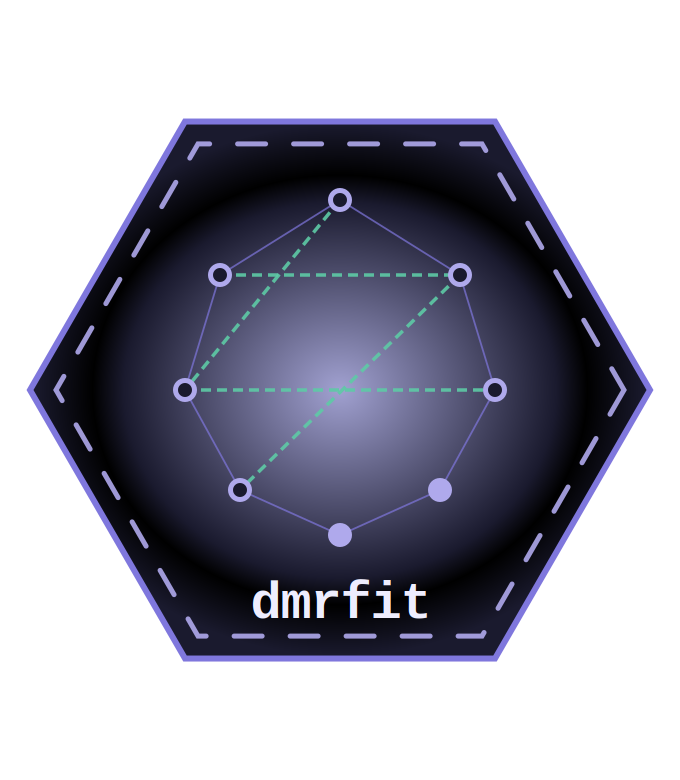

<br />



## **dmrfit** 

### _Optimization Tools for Discrete Markov Random Fields_

<!-- badges: start -->
[](https://www.repostatus.org/#active)
[](https://www.github.com/jupepis/dmrfit)
[](https://github.com/jupepis/dmrfit/actions/workflows/check-standard.yaml)
<!-- badges: end -->

<br />

A set of tools designed for estimating discrete Markov Random Fields via pseudolikelihood, for both Ising models (Ising, 1925) and Ordinal Markov Random Fields (Marsman et al., 2025). Parameters are estimated through a trust region optimization algorithm (Fletcher, R., 1987; Nocedal, J. and Wright, S.J., 1999), with robust standard error estimation. The package supports both full network estimation,  where all edges are included, and constrained network estimation, where only a specified subset of edges is considered.

<br />


### Installation

Install the package in R from CRAN:

```r
remotes::install_github("jupepis/dmrfit") # install package via remotes

library(dmrfit) # load the package
```
<br />

### Any issues with the package?

Should you encounter errors while using the package, or for reporting any kind of malfunction of the package, you can open an issue in [here](https://github.com/jupepis/dmrfit/issues). 

When opening an issue, please, use a descriptive title that clearly states the issue, be as thorough as possible when describing the issue, provide code snippets that can reproduce the issue.

<br />

### References
- Ising, E. (1925). Beitrag zur theorie des ferromagnetismus. _Zeitschrift für Physik_, 31(1):253–258.
- Fletcher, R. (1987). _Practical Methods of Optimization_. 2nd ed. Chichester: Wiley.
- Nocedal, J. and Wright, S.J. (1999). _Numerical Optimization_. New York: Springer.
- Marsman, M., van den Bergh, D., and Haslbeck, J. M. B. (2025). Bayesian analysis of the ordinal
Markov random field. _Psychometrika_, 90:146–182.

<br />
