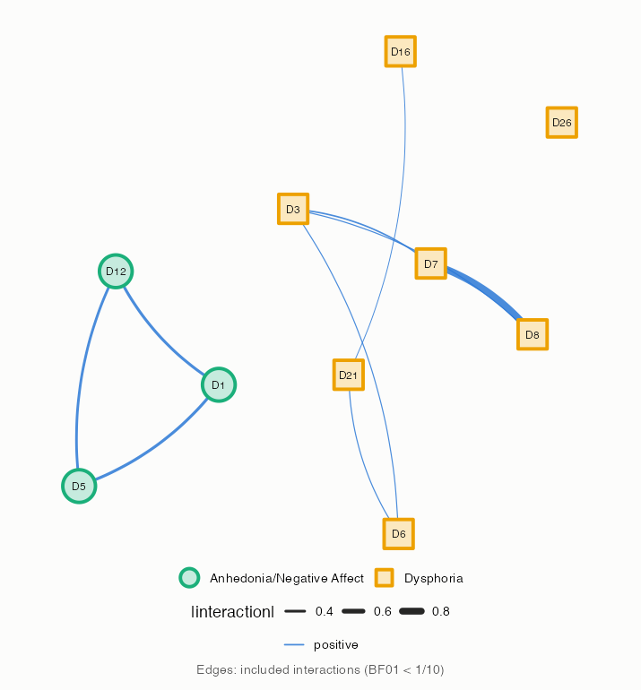
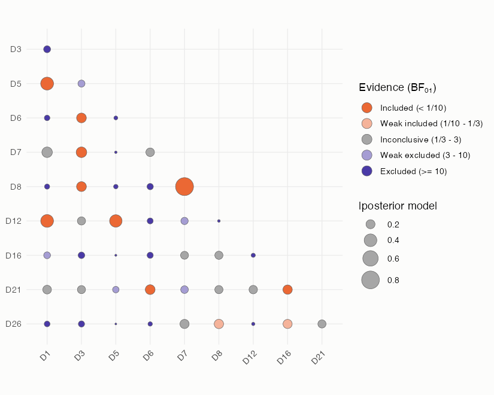
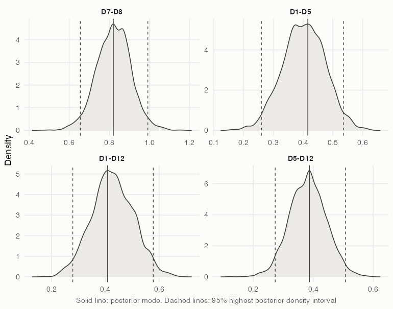
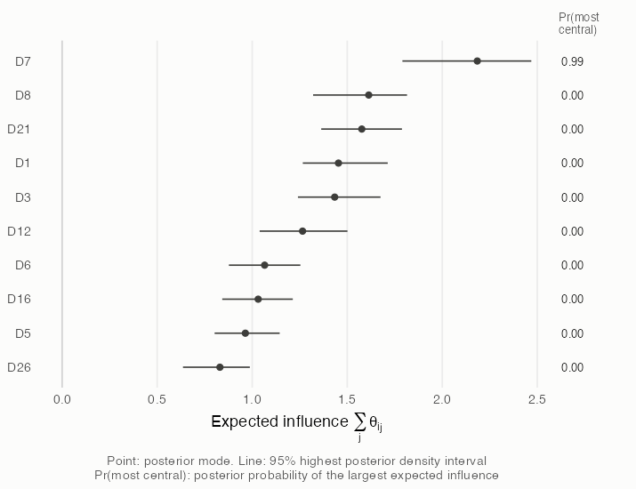
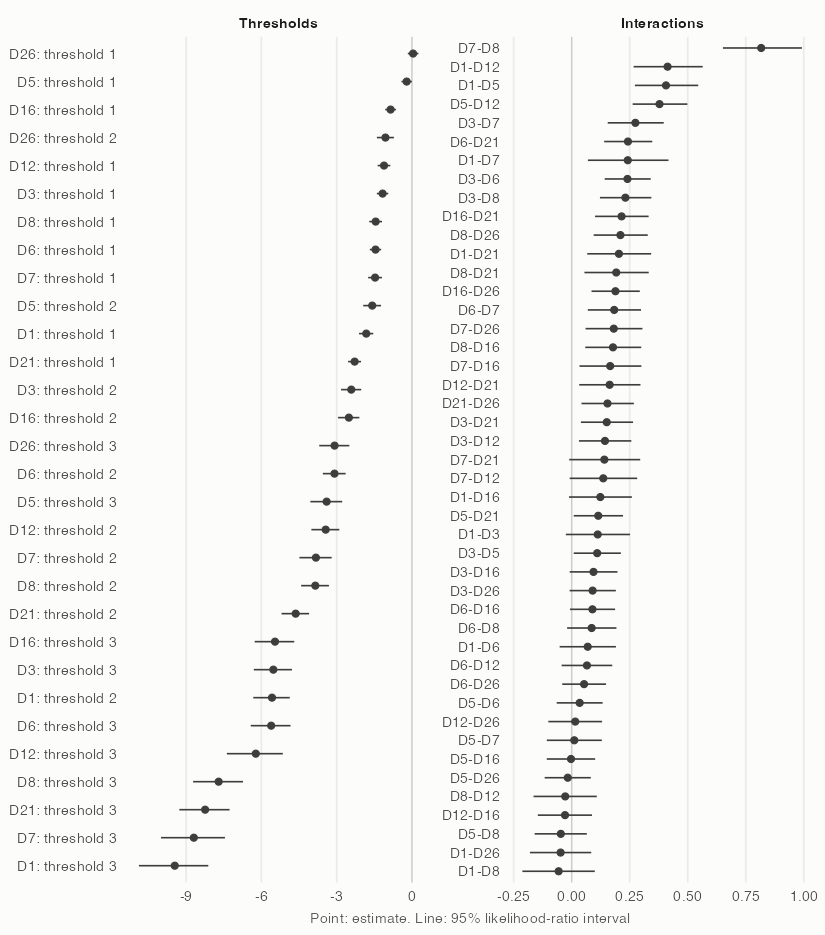

<!-- Top banner -->
<p align="center">
  
</p>

<!-- badges: start -->
[](https://www.repostatus.org/#active)
[](https://github.com/jupepis/dmrfit)
[](https://github.com/jupepis/dmrfit/actions/workflows/check-standard.yaml)
[](https://app.codecov.io/gh/jupepis/dmrfit)
<!-- badges: end -->

<br />

`dmrfit` estimates discrete Markov Random Fields, both Ising models (Ising, 1925) and Ordinal Markov Random Fields (Marsman et al., 2025), through the pseudo-likelihood. It offers a frequentist route, with point estimates from a trust region algorithm and robust standard errors, and a Bayesian route, in which the pseudo-posterior is corrected with coordinate rescaling (CoRe; Arena and Marsman, 2026). Point estimation supports both full network estimation, where all edges are included, and constrained network estimation, where only a specified subset of edges is considered.

<br />

## Main functionalities

**`dmrfit()`: point estimation and Bayes factors**
- Maximum pseudo-likelihood estimation, or maximum a posteriori estimation with `with_prior = TRUE` (Beta-Prime prior on the thresholds, Cauchy prior on the pairwise interactions), through a trust region algorithm (Fletcher, 1987; Nocedal and Wright, 1999).
- Robust standard errors from the Godambe-Huber-White (GHW, or sandwich) estimator, with Wald intervals, and with `lrt_intervals = TRUE` profile likelihood-ratio intervals adjusted for the pseudo-likelihood (Pace et al., 2011), which can be asymmetric when the sample size is small relative to the number of parameters. `confint()` returns either, and `summary()` prints them next to each other.
- Constrained estimation with `structure`, a P x P adjacency matrix of the edges to include.
- Savage-Dickey Bayes factors for each pairwise interaction with `savage_dickey = TRUE`, computed by sampling importance resampling from the coordinate-rescaled pseudo-posterior (Skare et al., 2003).
- Gradient, Hessian and pseudo-likelihood evaluations parallelized over `ncores`, with the same results for any number of cores.

**`dmrfit_bayes()`: posterior sampling**
- Draws from the coordinate-rescaled pseudo-posterior (`method = "core"`, default; Arena and Marsman, 2026), which corrects the underestimated posterior variability of the pseudo-likelihood. All methods use the Fisher adaptive Metropolis-adjusted Langevin algorithm (FisherMALA; Titsias, 2024).
- The pseudo-posterior is rescaled to the GHW covariance (`scale = "ghw"`, default), or to the inverse of a Monte Carlo estimate of the Hessian of the full log-posterior, at the pseudo-posterior mode (`scale = "mch"`) or at the Robbins-Monro estimate of the full-posterior mode (`scale = "rm"`).
- `method = "adacore"` adapts the rescaling during burn-in; `method = "exact"` samples the full-likelihood posterior for small networks, with the normalizing constant computed by enumeration; `method = "dmh"` samples it with the double Metropolis-Hastings algorithm (Liang, 2010), which is much slower.
- Posterior summaries (means, standard deviations, 95% credible intervals) and Savage-Dickey Bayes factors for each pairwise interaction, computed from the posterior draws; highest posterior density intervals with `confint()`.

**`plot()`: plots of both fit objects, made with ggplot2**
- `type = "network"`: the network of the included edges (Savage-Dickey Bayes factor `BF01 < 1/10`), with the edge width and color given by the size and sign of the interaction, and optional node groups.
- `type = "bf"`: the evidence for every edge, from excluded to included, with the size of the interaction.
- `type = "trace"` and `type = "density"`: the posterior draws of selected parameters, with highest posterior density intervals.
- `type = "intervals"`: the estimates and intervals of the thresholds and interactions.
- `type = "centrality"`: the expected influence of every variable, and its posterior probability of being the most central.
- `show_comments = FALSE` leaves out the explanation below the plot, for instance when it goes into the caption of a figure in a paper.

Both fitting functions return objects with `print()`, `summary()`, `confint()` and `plot()` methods.

<br />

## Installation

Install the development version from GitHub:

```r
remotes::install_github("jupepis/dmrfit") # install package via remotes

library(dmrfit) # load the package
```
<br />

## Example

```r
library(dmrfit)

# RADS-2 responses of 917 adolescents (25 items, 4 ordered categories). Here the 10 items of two clusters
data(rads2)
clusters <- attr(rads2, "clusters")
items <- names(clusters)[clusters %in% c("Dysphoria", "Anhedonia/Negative Affect")]

# Point estimates, GHW standard errors, likelihood-ratio intervals and Savage-Dickey Bayes factors
fit <- dmrfit(rads2[, items], with_prior = TRUE, savage_dickey = TRUE, lrt_intervals = TRUE)
summary(fit)
confint(fit)

# Posterior sampling from the coordinate-rescaled pseudo-posterior
fit_bayes <- dmrfit_bayes(rads2[, items], nsim = 5000, burnin = 1000)
summary(fit_bayes)
```

The example uses `rads2`, data from Ramos-Vera et al. (2023) distributed under the CC BY 4.0 license (see `?rads2`).

<br />

## Plots

```r
plot(fit_bayes, groups = clusters[items])  # network of the included edges, nodes grouped by cluster
plot(fit_bayes, type = "bf")               # evidence for every edge
```

<p align="center">
  
  
</p>

```r
plot(fit_bayes, type = "density")     # posterior densities of the four largest interactions
plot(fit_bayes, type = "centrality")  # expected influence of every item
```

<p align="center">
  
  
</p>

```r
plot(fit, type = "intervals")  # estimates and likelihood-ratio intervals
```

<p align="center">
  
</p>

<br />

## Any issues with the package?

Should you encounter errors while using the package, or for reporting any kind of malfunction of the package, you can open an issue in [here](https://github.com/jupepis/dmrfit/issues). 

When opening an issue, please, use a descriptive title that clearly states the issue, be as thorough as possible when describing the issue, provide code snippets that can reproduce the issue.

<br />

## References
- Arena, G. and Marsman, M. (2026). Bayesian inference for discrete Markov random fields through coordinate rescaling. _arXiv preprint_. https://doi.org/10.48550/arXiv.2601.17205
- Ising, E. (1925). Beitrag zur theorie des ferromagnetismus. _Zeitschrift für Physik_, 31(1):253–258.
- Fletcher, R. (1987). _Practical Methods of Optimization_. 2nd ed. Chichester: Wiley.
- Nocedal, J. and Wright, S.J. (1999). _Numerical Optimization_. New York: Springer.
- Pace, L., Salvan, A., and Sartori, N. (2011). Adjusting composite likelihood ratio statistics. _Statistica Sinica_, 21(1):129–148.
- Liang, F. (2010). A double Metropolis-Hastings sampler for spatial models with intractable normalizing constants. _Journal of Statistical Computation and Simulation_, 80(9):1007–1022.
- Marsman, M., van den Bergh, D., and Haslbeck, J. M. B. (2025). Bayesian analysis of the ordinal
Markov random field. _Psychometrika_, 90:146–182.
- Ramos-Vera, C., Quispe Callo, G., Basauri Delgado, M., Vallejos Saldarriaga, J., and Saintila, J. (2023). Factorial and network structure of the Reynolds Adolescent Depression Scale (RADS-2) in Peruvian adolescents. _PLOS ONE_, 18(5):e0286081.
- Skare, Ø., Bølviken, E., and Holden, L. (2003). Improved sampling-importance resampling and reduced bias importance sampling. _Scandinavian Journal of Statistics_, 30(4):719–737.
- Titsias, M. K. (2024). Optimal preconditioning and Fisher adaptive Langevin sampling. In _Proceedings of the 37th International Conference on Neural Information Processing Systems_ (NIPS '23). Red Hook, NY, USA: Curran Associates.

<br />
