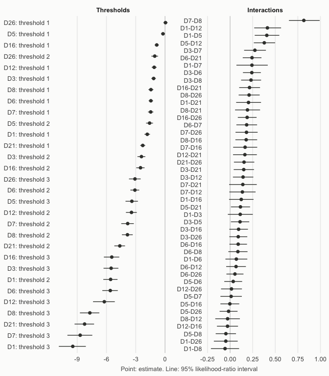
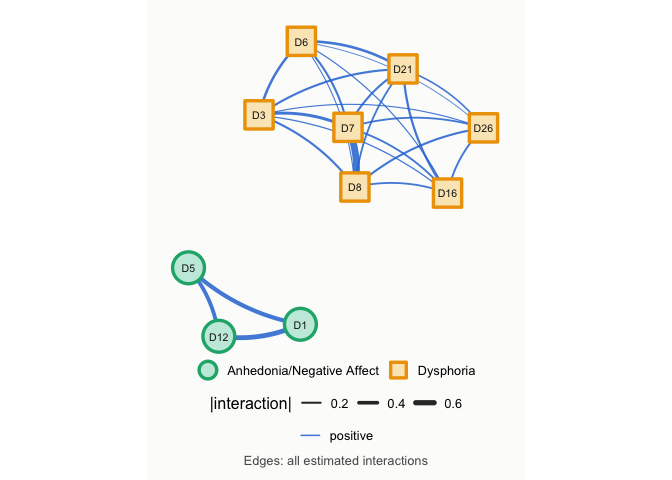
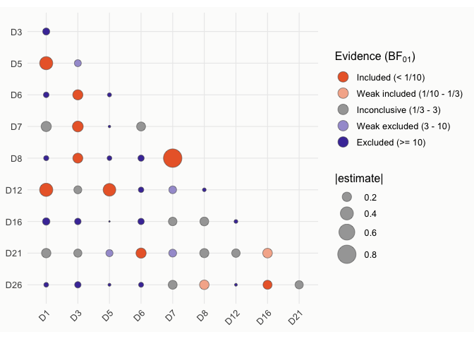
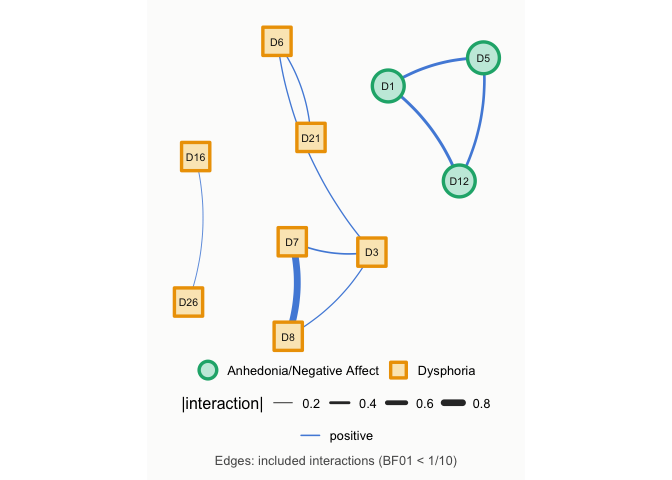
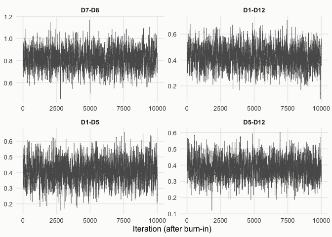
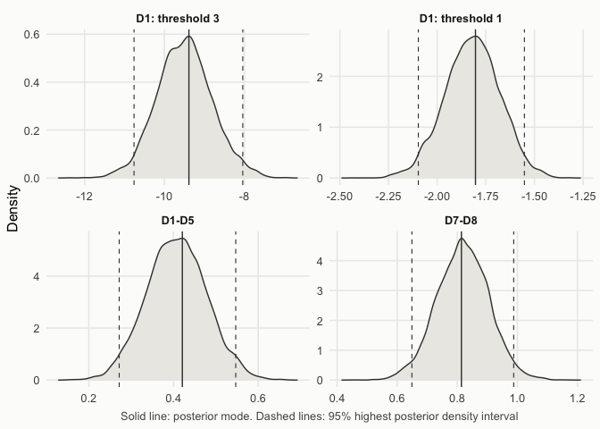
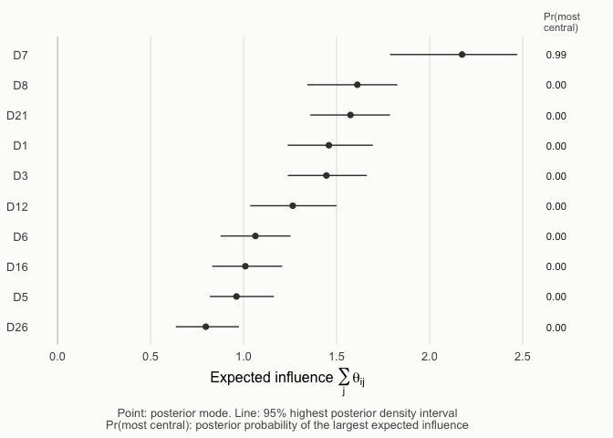

This vignette illustrates a complete network analysis with `dmrfit`. It covers point estimation with confidence
intervals, the evidence for each edge, Bayesian estimation, centrality, and the choice between the sampling methods.
Each section first describes how to run the analysis and interpret its output. The paragraphs titled *Details* explain the methods and can be skipped on
a first reading. The notation follows Arena and Marsman (2026).

## Discrete Markov random fields and the pseudo-likelihood

A discrete Markov random field models the conditional dependencies between discrete random variables, such as the
items of a questionnaire, as a network: two variables are connected when they are dependent given all the other
variables. Let $\mathbf{X} = (\mathbf{X}_1, \ldots, \mathbf{X}_n)$ denote the observed data for $n$ observations on $p$
ordinal variables, where each variable takes one of the categories $0, 1, \ldots, m$, and let $\mathbf{X}_{\nu} =
(X_{\nu 1}, \ldots, X_{\nu p})$ denote the $\nu$-th observation. The ordinal Markov random field (OMRF) is defined by the
parameter vector $\boldsymbol{\eta} = (\boldsymbol{\mu}, \boldsymbol{\theta})$, which comprises the threshold parameters
$\mu_{ih}$, the tendency of variable $i$ to take the non-baseline category $h = 1, \ldots, m$ that is not explained by
its interactions with the other variables, and the interaction parameters $\theta_{ij}$, the pairwise conditional
dependency between variables $i$ and $j$. An interaction $\theta_{ij} = 0$ means that variables $i$ and $j$ are
conditionally independent, that is, there is no edge between them. When the variables are binary, the OMRF reduces to
the Ising model.

The full likelihood of the OMRF contains a normalizing constant that sums over all $(m + 1)^p$ possible response
patterns, which is infeasible beyond a few variables. `dmrfit` uses the pseudo-likelihood instead, the product of the
conditional distributions of each variable given the remaining variables,
$$
\tilde{f}(\mathbf{X}; \boldsymbol{\eta}) = \prod_{\nu=1}^{n} \prod_{i=1}^{p} f\left(X_{\nu i} \mid \mathbf{X}_{\nu(-i)},
\boldsymbol{\eta}\right), \qquad
f\left(X_{\nu i} = h \mid \mathbf{X}_{\nu(-i)}, \boldsymbol{\eta}\right) =
\frac{\exp\left(\mu_{ih} + h \sum_{j \neq i} \theta_{ij} X_{\nu j}\right)}
{1 + \sum_{k=1}^{m} \exp\left(\mu_{ik} + k \sum_{j \neq i} \theta_{ij} X_{\nu j}\right)},
$$
with $\mu_{i0} = 0$, whose normalizing constants are computationally tractable. Combined with a prior
$\pi(\boldsymbol{\eta})$, it defines the pseudo-posterior
$\tilde{\pi}(\boldsymbol{\eta} \mid \mathbf{X}) \propto \tilde{f}(\mathbf{X}; \boldsymbol{\eta})\, \pi(\boldsymbol{\eta})$.
The pseudo-likelihood estimates are consistent, but the curvature of the pseudo-likelihood overstates the information
in the data: used naively, it underestimates the variability of the estimates and the posterior variance. The package
corrects this underestimation in two ways.

- `dmrfit()` estimates the parameters by maximizing the pseudo-likelihood (or the pseudo-posterior), with robust
  standard errors, confidence intervals and Bayes factors for the edges.
- `dmrfit_bayes()` samples from the pseudo-posterior rescaled to the scale of the full posterior (coordinate rescaling,
  CoRe, Arena and Marsman, 2026).


``` r
library(dmrfit)
```

## The data

`rads2` contains the responses of 917 adolescents from Lima (Peru) to the 25 items of the four-factor version of the
Reynolds Adolescent Depression Scale (RADS-2), each answered on a four-point scale (Ramos-Vera et al., 2023). The
positively worded items were reverse-coded, so that higher values mean more symptoms for every item. The items belong
to four clusters, stored with the data. Here we use the 10 items of two clusters, dysphoria and anhedonia/negative
affect, with $p = 10$ variables, $m + 1 = 4$ categories and $n = 917$ observations.


``` r
data(rads2)
clusters <- attr(rads2, "clusters")
items <- names(clusters)[clusters %in% c("Dysphoria", "Anhedonia/Negative Affect")]
X <- rads2[, items]
clusters[items]
#>                          D1                          D3 
#> "Anhedonia/Negative Affect"                 "Dysphoria" 
#>                          D5                          D6 
#> "Anhedonia/Negative Affect"                 "Dysphoria" 
#>                          D7                          D8 
#>                 "Dysphoria"                 "Dysphoria" 
#>                         D12                         D16 
#> "Anhedonia/Negative Affect"                 "Dysphoria" 
#>                         D21                         D26 
#>                 "Dysphoria"                 "Dysphoria"
```

The response frequencies show that the highest category is rarely chosen for some items. This matters below, because a
threshold of a rare category is estimated from few observations.


``` r
sapply(X, function(item) table(factor(item, levels = 1:4)))
#>    D1  D3  D5  D6  D7  D8 D12 D16 D21 D26
#> 1 500 275 257 417 282 323 384 325 495 177
#> 2 325 231 348 243 265 275 331 324 208 339
#> 3  66 295 200 175 281 219 137 209 151 275
#> 4  26 116 112  82  89 100  65  59  63 126
```

## Point estimation and confidence intervals

`dmrfit()` estimates the thresholds and interactions. With `with_prior = TRUE` it maximizes the pseudo-posterior,
which gives the maximum a posteriori (MAP) estimate, with beta-prime priors on the exponentiated thresholds,
$\exp(\mu_{ih}) \sim \text{Beta-Prime}(0.5, 0.5)$, and Cauchy priors on the interactions, $\theta_{ij} \sim
\text{Cauchy}(0, 2.5)$. Without the prior it gives the maximum pseudo-likelihood estimate (MPLE). `lrt_intervals = TRUE`
adds likelihood-ratio intervals for all parameters, and `savage_dickey = TRUE` the Bayes factors of the next section.


``` r
fit <- dmrfit(X, with_prior = TRUE, savage_dickey = TRUE, lrt_intervals = TRUE)
```

In the output, `mu[i,h]` is the threshold $\mu_{ih}$ and `theta[i,j]` the interaction $\theta_{ij}$, with the
variables numbered in the column order of the data. `summary()` prints the estimates with their standard errors, and
the Wald and likelihood-ratio intervals next to each other.


``` r
summary(fit)
#> 
#> Call:
#> dmrfit(data = X, with_prior = TRUE, savage_dickey = TRUE, lrt_intervals = TRUE)
#> 
#> Discrete Markov Random Field
#> Estimation method: maximum pseudo-likelihood (with prior)
#> Nodes: 10  Observations: 917  Free parameters: 75 
#> Standard errors: Godambe-Huber-White (GHW) estimator
#> ------------------------------------------------------------ 
#> 
#> Thresholds:
#>          Post.Mode   Post.SD  z value  Pr(>|z|)
#> mu[1,1]  -1.820877  0.144418 -12.6084 < 2.2e-16
#> mu[1,2]  -5.576649  0.370759 -15.0412 < 2.2e-16
#> mu[1,3]  -9.452950  0.705495 -13.3990 < 2.2e-16
#> mu[2,1]  -1.169270  0.115919 -10.0870 < 2.2e-16
#> mu[2,2]  -2.417688  0.205029 -11.7920 < 2.2e-16
#> mu[2,3]  -5.524127  0.387496 -14.2560 < 2.2e-16
#> mu[3,1]  -0.209862  0.105177  -1.9953   0.04601
#> mu[3,2]  -1.582957  0.180676  -8.7613 < 2.2e-16
#> mu[3,3]  -3.399964  0.323605 -10.5065 < 2.2e-16
#> mu[4,1]  -1.451465  0.114853 -12.6376 < 2.2e-16
#> mu[4,2]  -3.087075  0.231522 -13.3338 < 2.2e-16
#> mu[4,3]  -5.610251  0.404348 -13.8748 < 2.2e-16
#> mu[5,1]  -1.468367  0.140364 -10.4611 < 2.2e-16
#> mu[5,2]  -3.827827  0.327542 -11.6865 < 2.2e-16
#> mu[5,3]  -8.693257  0.650305 -13.3680 < 2.2e-16
#> mu[6,1]  -1.445533  0.129159 -11.1918 < 2.2e-16
#> mu[6,2]  -3.850868  0.282119 -13.6498 < 2.2e-16
#> mu[6,3]  -7.703633  0.506745 -15.2022 < 2.2e-16
#> mu[7,1]  -1.112222  0.128882  -8.6298 < 2.2e-16
#> mu[7,2]  -3.438122  0.283897 -12.1105 < 2.2e-16
#> mu[7,3]  -6.222909  0.568813 -10.9402 < 2.2e-16
#> mu[8,1]  -0.850789  0.108832  -7.8175 5.389e-15
#> mu[8,2]  -2.513389  0.216437 -11.6125 < 2.2e-16
#> mu[8,3]  -5.457662  0.402758 -13.5507 < 2.2e-16
#> mu[9,1]  -2.282995  0.131021 -17.4247 < 2.2e-16
#> mu[9,2]  -4.633978  0.279444 -16.5829 < 2.2e-16
#> mu[9,3]  -8.242312  0.510441 -16.1474 < 2.2e-16
#> mu[10,1]  0.045836  0.107724   0.4255   0.67048
#> mu[10,2] -1.056172  0.173051  -6.1032 1.039e-09
#> mu[10,3] -3.082789  0.305565 -10.0888 < 2.2e-16
#> 
#> Pairwise interactions:
#>              Post.Mode    Post.SD z value  Pr(>|z|)    
#> theta[2,1]   0.1121620  0.0703940  1.5933 0.1110827    
#> theta[3,1]   0.4062825  0.0694625  5.8490 4.947e-09 ***
#> theta[4,1]   0.0689947  0.0617306  1.1177 0.2637062    
#> theta[5,1]   0.2416338  0.0884372  2.7323 0.0062900 ** 
#> theta[6,1]  -0.0561661  0.0794795 -0.7067 0.4797695    
#> theta[7,1]   0.4131106  0.0758050  5.4496 5.047e-08 ***
#> theta[8,1]   0.1234728  0.0690276  1.7887 0.0736560 .  
#> theta[9,1]   0.2035943  0.0701258  2.9033 0.0036929 ** 
#> theta[10,1] -0.0476660  0.0672855 -0.7084 0.4786879    
#> theta[3,2]   0.1099157  0.0517141  2.1255 0.0335490 *  
#> theta[4,2]   0.2402308  0.0504967  4.7574 1.961e-06 ***
#> theta[5,2]   0.2744462  0.0614688  4.4648 8.014e-06 ***
#> theta[6,2]   0.2313118  0.0564412  4.0983 4.162e-05 ***
#> theta[7,2]   0.1433946  0.0575102  2.4934 0.0126535 *  
#> theta[8,2]   0.0939737  0.0524526  1.7916 0.0731982 .  
#> theta[9,2]   0.1510427  0.0572081  2.6402 0.0082850 ** 
#> theta[10,2]  0.0902188  0.0507052  1.7793 0.0751938 .  
#> theta[4,3]   0.0343960  0.0504221  0.6822 0.4951364    
#> theta[5,3]   0.0113068  0.0603851  0.1872 0.8514689    
#> theta[6,3]  -0.0468243  0.0572661 -0.8177 0.4135508    
#> theta[7,3]   0.3783185  0.0600302  6.3021 2.936e-10 ***
#> theta[8,3]  -0.0029214  0.0531458 -0.0550 0.9561629    
#> theta[9,3]   0.1144986  0.0540580  2.1181 0.0341691 *  
#> theta[10,3] -0.0168471  0.0506416 -0.3327 0.7393810    
#> theta[5,4]   0.1831356  0.0584058  3.1356 0.0017152 ** 
#> theta[6,4]   0.0861031  0.0541438  1.5903 0.1117747    
#> theta[7,4]   0.0657230  0.0555872  1.1823 0.2370703    
#> theta[8,4]   0.0894205  0.0495450  1.8048 0.0711011 .  
#> theta[9,4]   0.2424225  0.0527873  4.5924 4.381e-06 ***
#> theta[10,4]  0.0534099  0.0480940  1.1105 0.2667697    
#> theta[6,5]   0.8163969  0.0866513  9.4216 < 2.2e-16 ***
#> theta[7,5]   0.1360569  0.0740861  1.8365 0.0662881 .  
#> theta[8,5]   0.1658596  0.0679567  2.4407 0.0146602 *  
#> theta[9,5]   0.1407857  0.0779097  1.8070 0.0707566 .  
#> theta[10,5]  0.1813855  0.0623835  2.9076 0.0036423 ** 
#> theta[7,6]  -0.0278154  0.0694366 -0.4006 0.6887246    
#> theta[8,6]   0.1779921  0.0614563  2.8962 0.0037766 ** 
#> theta[9,6]   0.1920124  0.0705658  2.7210 0.0065076 ** 
#> theta[10,6]  0.2100408  0.0593717  3.5377 0.0004036 ***
#> theta[8,7]  -0.0286764  0.0594765 -0.4821 0.6297012    
#> theta[9,7]   0.1635554  0.0672080  2.4336 0.0149508 *  
#> theta[10,7]  0.0152829  0.0590018  0.2590 0.7956162    
#> theta[9,8]   0.2149666  0.0587718  3.6576 0.0002545 ***
#> theta[10,8]  0.1885638  0.0529913  3.5584 0.0003731 ***
#> theta[10,9]  0.1542764  0.0574723  2.6844 0.0072668 ** 
#> ---
#> Signif. codes:  0 '***' 0.001 '**' 0.01 '*' 0.05 '.' 0.1 ' ' 1
#> 
#> Intervals (95%): Wald (GHW standard errors) and likelihood-ratio
#>             Wald lower Wald upper LRT lower LRT upper
#> mu[1,1]        -2.1039    -1.5378   -2.1084   -1.5420
#> mu[1,2]        -6.3033    -4.8500   -6.3232   -4.8697
#> mu[1,3]       -10.8357    -8.0702  -10.8810   -8.1158
#> mu[2,1]        -1.3965    -0.9421   -1.3976   -0.9430
#> mu[2,2]        -2.8195    -2.0158   -2.8260   -2.0219
#> mu[2,3]        -6.2836    -4.7646   -6.3009   -4.7818
#> mu[3,1]        -0.4160    -0.0037   -0.4156   -0.0031
#> mu[3,2]        -1.9371    -1.2288   -1.9406   -1.2319
#> mu[3,3]        -4.0342    -2.7657   -4.0485   -2.7794
#> mu[4,1]        -1.6766    -1.2264   -1.6787   -1.2282
#> mu[4,2]        -3.5409    -2.6333   -3.5508   -2.6428
#> mu[4,3]        -6.4028    -4.8177   -6.4247   -4.8395
#> mu[5,1]        -1.7435    -1.1933   -1.7456   -1.1951
#> mu[5,2]        -4.4698    -3.1859   -4.4842   -3.1999
#> mu[5,3]        -9.9678    -7.4187  -10.0023   -7.4533
#> mu[6,1]        -1.6987    -1.1924   -1.7008   -1.1943
#> mu[6,2]        -4.4038    -3.2979   -4.4153   -3.3092
#> mu[6,3]        -8.6968    -6.7104   -8.7206   -6.7343
#> mu[7,1]        -1.3648    -0.8596   -1.3668   -0.8614
#> mu[7,2]        -3.9945    -2.8817   -4.0077   -2.8943
#> mu[7,3]        -7.3378    -5.1081   -7.3762   -5.1463
#> mu[8,1]        -1.0641    -0.6375   -1.0649   -0.6381
#> mu[8,2]        -2.9376    -2.0892   -2.9453   -2.0964
#> mu[8,3]        -6.2471    -4.6683   -6.2679   -4.6889
#> mu[9,1]        -2.5398    -2.0262   -2.5436   -2.0298
#> mu[9,2]        -5.1817    -4.0863   -5.1954   -4.0999
#> mu[9,3]        -9.2428    -7.2419   -9.2697   -7.2691
#> mu[10,1]       -0.1653     0.2570   -0.1640    0.2585
#> mu[10,2]       -1.3953    -0.7170   -1.3974   -0.7186
#> mu[10,3]       -3.6817    -2.4839   -3.6938   -2.4955
#> theta[2,1]     -0.0258     0.2501   -0.0250    0.2512
#> theta[3,1]      0.2701     0.5424    0.2724    0.5450
#> theta[4,1]     -0.0520     0.1900   -0.0518    0.1904
#> theta[5,1]      0.0683     0.4150    0.0699    0.4170
#> theta[6,1]     -0.2119     0.0996   -0.2123    0.0996
#> theta[7,1]      0.2645     0.5617    0.2668    0.5644
#> theta[8,1]     -0.0118     0.2588   -0.0116    0.2594
#> theta[9,1]      0.0662     0.3410    0.0671    0.3424
#> theta[10,1]    -0.1795     0.0842   -0.1798    0.0842
#> theta[3,2]      0.0086     0.2113    0.0089    0.2119
#> theta[4,2]      0.1413     0.3392    0.1423    0.3404
#> theta[5,2]      0.1540     0.3949    0.1553    0.3964
#> theta[6,2]      0.1207     0.3419    0.1218    0.3432
#> theta[7,2]      0.0307     0.2561    0.0313    0.2570
#> theta[8,2]     -0.0088     0.1968   -0.0085    0.1973
#> theta[9,2]      0.0389     0.2632    0.0399    0.2644
#> theta[10,2]    -0.0092     0.1896   -0.0088    0.1901
#> theta[4,3]     -0.0644     0.1332   -0.0645    0.1333
#> theta[5,3]     -0.1070     0.1297   -0.1071    0.1298
#> theta[6,3]     -0.1591     0.0654   -0.1595    0.0652
#> theta[7,3]      0.2607     0.4960    0.2627    0.4983
#> theta[8,3]     -0.1071     0.1012   -0.1073    0.1012
#> theta[9,3]      0.0085     0.2205    0.0089    0.2211
#> theta[10,3]    -0.1161     0.0824   -0.1164    0.0824
#> theta[5,4]      0.0687     0.2976    0.0695    0.2987
#> theta[6,4]     -0.0200     0.1922   -0.0196    0.1928
#> theta[7,4]     -0.0432     0.1747   -0.0433    0.1749
#> theta[8,4]     -0.0077     0.1865   -0.0075    0.1870
#> theta[9,4]      0.1390     0.3459    0.1400    0.3472
#> theta[10,4]    -0.0409     0.1477   -0.0407    0.1480
#> theta[6,5]      0.6466     0.9862    0.6517    0.9917
#> theta[7,5]     -0.0091     0.2813   -0.0086    0.2822
#> theta[8,5]      0.0327     0.2991    0.0336    0.3003
#> theta[9,5]     -0.0119     0.2935   -0.0106    0.2952
#> theta[10,5]     0.0591     0.3037    0.0600    0.3048
#> theta[7,6]     -0.1639     0.1083   -0.1643    0.1082
#> theta[8,6]      0.0575     0.2984    0.0584    0.2996
#> theta[9,6]      0.0537     0.3303    0.0549    0.3319
#> theta[10,6]     0.0937     0.3264    0.0947    0.3277
#> theta[8,7]     -0.1452     0.0879   -0.1457    0.0877
#> theta[9,7]      0.0318     0.2953    0.0324    0.2963
#> theta[10,7]    -0.1004     0.1309   -0.1005    0.1310
#> theta[9,8]      0.0998     0.3302    0.1007    0.3314
#> theta[10,8]     0.0847     0.2924    0.0855    0.2934
#> theta[10,9]     0.0416     0.2669    0.0424    0.2680
#> 
#> Negative log pseudo-likelihood: 9654.417 
#> 
#> Savage-Dickey density ratio  [prior: Cauchy( 0 , 2.5 )]
#> H0: theta = 0 for each pairwise interaction
#> 
#>             Estimate     SE    BF_01 Pr(=0|x)
#> theta[2,1]    0.1122 0.0704    12.35   0.9251
#> theta[3,1]    0.4063 0.0695 < 0.0001 < 0.0001
#> theta[4,1]    0.0690 0.0617    24.28   0.9604
#> theta[5,1]    0.2416 0.0884   0.8117    0.448
#> theta[6,1]   -0.0562 0.0795    29.92   0.9677
#> theta[7,1]    0.4131 0.0758 < 0.0001 < 0.0001
#> theta[8,1]    0.1235 0.0690    10.83   0.9155
#> theta[9,1]    0.2036 0.0701    1.132   0.5309
#> theta[10,1]  -0.0477 0.0673    30.68   0.9684
#> theta[3,2]    0.1099 0.0517    9.208    0.902
#> theta[4,2]    0.2402 0.0505 < 0.0001 < 0.0001
#> theta[5,2]    0.2744 0.0615 < 0.0001 < 0.0001
#> theta[6,2]    0.2313 0.0564 < 0.0001 < 0.0001
#> theta[7,2]    0.1434 0.0575    1.512    0.602
#> theta[8,2]    0.0940 0.0525    12.54   0.9261
#> theta[9,2]    0.1510 0.0572    1.667    0.625
#> theta[10,2]   0.0902 0.0507    15.88   0.9408
#> theta[4,3]    0.0344 0.0504       51   0.9808
#> theta[5,3]    0.0113 0.0604    58.36   0.9832
#> theta[6,3]   -0.0468 0.0573    38.94    0.975
#> theta[7,3]    0.3783 0.0600 < 0.0001 < 0.0001
#> theta[8,3]   -0.0029 0.0531    61.41    0.984
#> theta[9,3]    0.1145 0.0541    6.342   0.8638
#> theta[10,3]  -0.0168 0.0506    60.07   0.9836
#> theta[5,4]    0.1831 0.0584   0.6128   0.3799
#> theta[6,4]    0.0861 0.0541    21.56   0.9557
#> theta[7,4]    0.0657 0.0556    26.24   0.9633
#> theta[8,4]    0.0894 0.0495    8.474   0.8944
#> theta[9,4]    0.2424 0.0528 < 0.0001 < 0.0001
#> theta[10,4]   0.0534 0.0481    41.02   0.9762
#> theta[6,5]    0.8164 0.0867 < 0.0001 < 0.0001
#> theta[7,5]    0.1361 0.0741    10.09   0.9098
#> theta[8,5]    0.1659 0.0680    1.655   0.6233
#> theta[9,5]    0.1408 0.0779     9.86   0.9079
#> theta[10,5]   0.1814 0.0624    1.816   0.6448
#> theta[7,6]   -0.0278 0.0694    46.33   0.9789
#> theta[8,6]    0.1780 0.0615    0.809   0.4472
#> theta[9,6]    0.1920 0.0706    1.017   0.5041
#> theta[10,6]   0.2100 0.0594 < 0.0001 < 0.0001
#> theta[8,7]   -0.0287 0.0595    42.37   0.9769
#> theta[9,7]    0.1636 0.0672    1.834   0.6471
#> theta[10,7]   0.0153 0.0590    45.56   0.9785
#> theta[9,8]    0.2150 0.0588  0.05081  0.04836
#> theta[10,8]   0.1886 0.0530 < 0.0001 < 0.0001
#> theta[10,9]   0.1543 0.0575    1.487   0.5979
#> 
#> '<': zero lies beyond all resampled draws, so BF_01 is only bounded (very strong evidence for an interaction).
#> 
#> SIR samples: 1000   Effective sample size of the importance sample: 2648.7 (of 10000 proposal draws)
```

The two kinds of intervals agree for most parameters, but not for the thresholds of the rarely chosen highest
categories. For item D1, whose highest category was chosen 26 times, the likelihood-ratio interval of
$\mu_{13}$ extends further below the estimate than above it, which the symmetric Wald interval cannot do:


``` r
confint(fit, parm = c("mu[1,3]", "theta[2,1]"))
#>                   2.5 %     97.5 %
#> mu[1,3]    -10.88102304 -8.1158110
#> theta[2,1]  -0.02504397  0.2512157
confint(fit, parm = c("mu[1,3]", "theta[2,1]"), method = "wald")
#>                   2.5 %     97.5 %
#> mu[1,3]    -10.83569524 -8.0702043
#> theta[2,1]  -0.02580772  0.2501316
```

`plot(fit, type = "intervals")` shows the estimates and intervals of all parameters, the thresholds and the interactions
in separate panels, each sorted by estimate.


``` r
plot(fit, type = "intervals")
```

<div class="figure" style="text-align: center">

<p class="caption">plot of chunk intervals</p>
</div>

When the sample is small relative to the number of parameters and the likelihood-ratio intervals are not computed,
`dmrfit()` warns that the Wald intervals may be inaccurate:


``` r
fit_small <- dmrfit(X[1:200, ])
#> Warning in dmrfit(X[1:200, ]): The sample size (200) is small relative to the
#> number of free parameters (75): the Wald intervals assume a symmetric sampling
#> distribution and may be inaccurate. Likelihood-ratio intervals are suggested:
#> refit with lrt_intervals = TRUE (or a vector of parameter names).
```

*Details.* The standard errors come from the Godambe-Huber-White (GHW, or sandwich) covariance
$$
\boldsymbol{\Sigma}_{\text{GHW}} = \left(-\mathbf{H}^{-1}\right) \mathbf{U} \left(-\mathbf{H}^{-1}\right),
$$
where $\mathbf{H}$ is the Hessian of the log pseudo-likelihood and $\mathbf{U} = \sum_{\nu=1}^{n} \mathbf{u}_{\nu}
\mathbf{u}_{\nu}^{\intercal}$ the variance of the score, both evaluated at the estimate $\hat{\boldsymbol{\eta}}$. The
naive covariance $-\mathbf{H}^{-1}$ would underestimate the variability. The likelihood-ratio interval of a parameter
$\eta_k$ is based on its profile: for every value of $\eta_k$, the other parameters are set to the values that maximize
the pseudo-likelihood. Because it is computed from a pseudo-likelihood, the profile likelihood-ratio statistic is not
$\chi^2_1$-distributed but $\lambda_k \chi^2_1$-distributed, with $\lambda_k = [\boldsymbol{\Sigma}_{\text{GHW}}]_{kk} /
[-\mathbf{H}^{-1}]_{kk}$ (Geys, Molenberghs and Ryan, 1999; Pace, Salvan and Sartori, 2011). The interval collects the values of $\eta_k$ for which
$$
\frac{2}{\lambda_k} \left[\log \tilde{f}(\mathbf{X}; \hat{\boldsymbol{\eta}}) - \max_{\boldsymbol{\eta}_{-k}} \log
\tilde{f}(\mathbf{X}; \eta_k, \boldsymbol{\eta}_{-k})\right] \leq \chi^2_{1, 1 - \alpha},
$$
with $\chi^2_{1, 1 - \alpha}$ the quantile of the $\chi^2_1$ distribution at the level of the interval. When a prior is
used, the pseudo-posterior takes the place of the pseudo-likelihood, and $\lambda_k$ is computed from its curvature
$-(\mathbf{H} + \mathbf{H}_{\boldsymbol{\eta}})$, with $\mathbf{H}_{\boldsymbol{\eta}}$ the Hessian of the log prior,
and from the posterior GHW covariance $\boldsymbol{\Gamma}\boldsymbol{\Gamma}^{\intercal}_{\text{GHW}} =
(\boldsymbol{\Sigma}_{\text{GHW}}^{-1} - \mathbf{H}_{\boldsymbol{\eta}})^{-1}$. The interval follows the shape of the
pseudo-likelihood, so it can be asymmetric, and in large samples it agrees with the Wald interval.

A network structure can also be imposed with `structure`, a matrix with 1 for the edges to estimate and 0 for the edges
fixed at zero. For instance, without edges between the two clusters:


``` r
S <- outer(clusters[items], clusters[items], "==") * 1
diag(S) <- 0
fit_within <- dmrfit(X, structure = S, with_prior = TRUE)
plot(fit_within, all_edges = TRUE, groups = clusters[items])
```

<div class="figure" style="text-align: center">

<p class="caption">plot of chunk network-within</p>
</div>

## Is the edge there? Bayes factors

An interaction estimated close to zero does not tell whether the edge is absent or the data are not informative enough
to tell. The Savage-Dickey Bayes factor $\text{BF}_{01}$ (denoted $\text{BF}_{\text{cu}}$ in Arena and Marsman, 2026)
compares the hypothesis of conditional independence, $\theta_{ij} = 0$, with the hypothesis $\theta_{ij} \neq 0$:
$\text{BF}_{01} > 1$ is evidence for conditional independence (no edge), and $\text{BF}_{01} < 1$ evidence for an
interaction. The plots classify the evidence for each edge as

| $\text{BF}_{01}$ | Evidence |
|---|---|
| $< 1/10$ | included |
| $1/10$ to $1/3$ | weak included |
| $1/3$ to $3$ | inconclusive |
| $3$ to $10$ | weak excluded |
| $\geq 10$ | excluded |


``` r
evidence <- table(cut(fit$savage_dickey$bf_01, c(0, 1/10, 1/3, 3, 10, Inf), right = FALSE,
                      labels = c("included", "weak included", "inconclusive", "weak excluded", "excluded")))
evidence
#> 
#>      included weak included  inconclusive weak excluded      excluded 
#>            11             0            11             4            19
```

Of the 45 possible edges, 11 are included and
19 excluded, and the data leave 11 inconclusive.
`plot(fit, type = "bf")` shows the evidence for every edge, with the size of the circle given by the size of the
interaction, and the network plot draws the included edges.


``` r
plot(fit, type = "bf")
```

<div class="figure" style="text-align: center">

<p class="caption">plot of chunk bf-network</p>
</div>

``` r
plot(fit, groups = clusters[items])
```

<div class="figure" style="text-align: center">

<p class="caption">plot of chunk bf-network</p>
</div>

*Details.* The Savage-Dickey Bayes factor is the ratio of the marginal posterior and the prior density of the
interaction at zero, $\text{BF}_{01} = \pi(\theta_{ij} = 0 \mid \mathbf{X}) / \pi(\theta_{ij} = 0)$. `dmrfit()`
estimates the posterior density from draws of the coordinate-rescaled pseudo-posterior (see the next section), obtained
by sampling importance resampling (Skare et al., 2003). When zero lies beyond all draws of an interaction
(10 interactions here), the density at zero cannot be estimated. The Bayes
factor is then set at the floor $1/(10M)$, with $M$ the number of resampled draws, a bound that indicates very strong
evidence for an interaction, and `summary()` marks it with `<`.

## Bayesian estimation with coordinate rescaling

`dmrfit_bayes()` samples from the posterior of the parameters. By default, it samples the coordinate-rescaled
pseudo-posterior, which has the location of the pseudo-posterior and the scale of the GHW covariance.


``` r
fit_bayes <- dmrfit_bayes(X, nsim = 10000, burnin = 1000, progress = FALSE)
```

We first assess the convergence and mixing of the chain. The trace plot shows the draws of the
interactions with the largest absolute posterior modes, which should fluctuate around a stable level, without trends.
The effective sample sizes (ESS) summarize the mixing.


``` r
plot(fit_bayes, type = "trace")
```

<div class="figure" style="text-align: center">

<p class="caption">plot of chunk trace</p>
</div>

``` r
min(fit_bayes$savage_dickey$ess)  # smallest effective sample size of a parameter
#> [1] 741.6517
fit_bayes$mess                    # multivariate effective sample size of all draws
#> [1] 2006.834
```

The posterior densities show the posterior mode (solid line) and the 95% highest posterior density interval (dashed
lines), the shortest interval that contains 95% of the posterior.


``` r
plot(fit_bayes, type = "density", pars = c("mu[1,3]", "mu[1,1]", "theta[3,1]", "theta[6,5]"))
```

<div class="figure" style="text-align: center">

<p class="caption">plot of chunk density</p>
</div>

`summary()` reports the posterior summaries and the Bayes factors computed from the draws, and `confint()` the highest
posterior density intervals. The Bayes factors from the draws and from `dmrfit()` agree closely: they classify
87%
of the edges in the same evidence class.


``` r
summary(fit_bayes)
#> 
#> Call:
#> dmrfit_bayes(data = X, nsim = 10000, burnin = 1000, progress = FALSE)
#> 
#> Discrete Markov Random Field
#> Estimation method: Bayesian (FisherMALA), coordinate-rescaled pseudo-posterior (Godambe-Huber-White covariance) 
#> Nodes: 10  Observations: 917  Parameters: 75 
#> MCMC samples: 10000  Acceptance rate: 0.579  Elapsed: 5.5 sec
#> Multivariate effective sample size: 2006.8 
#> ------------------------------------------------------------ 
#> 
#> Thresholds:
#>          Post.Mode Post.Mean Post.SD     2.5%   97.5%
#> mu[1,1]    -1.8209   -1.8195  0.1413  -2.0957 -1.5488
#> mu[1,2]    -5.5766   -5.5764  0.3624  -6.2736 -4.8548
#> mu[1,3]    -9.4529   -9.4953  0.6911 -10.8322 -8.0860
#> mu[2,1]    -1.1693   -1.1648  0.1157  -1.3961 -0.9486
#> mu[2,2]    -2.4177   -2.4062  0.2061  -2.8224 -1.9958
#> mu[2,3]    -5.5241   -5.5083  0.3879  -6.2669 -4.7586
#> mu[3,1]    -0.2099   -0.2078  0.1063  -0.4132 -0.0033
#> mu[3,2]    -1.5830   -1.5719  0.1842  -1.9278 -1.2050
#> mu[3,3]    -3.4000   -3.3915  0.3237  -4.0296 -2.7634
#> mu[4,1]    -1.4515   -1.4448  0.1178  -1.6742 -1.2167
#> mu[4,2]    -3.0871   -3.0676  0.2371  -3.5437 -2.6209
#> mu[4,3]    -5.6103   -5.5944  0.4105  -6.4140 -4.8052
#> mu[5,1]    -1.4684   -1.4695  0.1430  -1.7454 -1.1861
#> mu[5,2]    -3.8278   -3.8291  0.3309  -4.4680 -3.1688
#> mu[5,3]    -8.6933   -8.6951  0.6522  -9.9747 -7.4016
#> mu[6,1]    -1.4455   -1.4365  0.1340  -1.6989 -1.1778
#> mu[6,2]    -3.8509   -3.8328  0.2891  -4.3973 -3.2692
#> mu[6,3]    -7.7036   -7.6765  0.5182  -8.6959 -6.6631
#> mu[7,1]    -1.1122   -1.1050  0.1290  -1.3637 -0.8641
#> mu[7,2]    -3.4381   -3.4370  0.2822  -3.9856 -2.8854
#> mu[7,3]    -6.2229   -6.2466  0.5712  -7.3548 -5.1115
#> mu[8,1]    -0.8508   -0.8460  0.1077  -1.0579 -0.6352
#> mu[8,2]    -2.5134   -2.4993  0.2163  -2.9321 -2.0811
#> mu[8,3]    -5.4577   -5.4531  0.4114  -6.2679 -4.6529
#> mu[9,1]    -2.2830   -2.2898  0.1317  -2.5436 -2.0331
#> mu[9,2]    -4.6340   -4.6481  0.2760  -5.1841 -4.0957
#> mu[9,3]    -8.2423   -8.2867  0.5058  -9.2708 -7.2805
#> mu[10,1]    0.0458    0.0569  0.1069  -0.1518  0.2675
#> mu[10,2]   -1.0562   -1.0324  0.1747  -1.3797 -0.6839
#> mu[10,3]   -3.0828   -3.0376  0.3082  -3.6558 -2.4412
#> 
#> Pairwise interactions:
#>             Post.Mode Post.Mean Post.SD    2.5%  97.5%
#> theta[2,1]     0.1122    0.1191  0.0698 -0.0163 0.2603
#> theta[3,1]     0.4063    0.4072  0.0705  0.2712 0.5467
#> theta[4,1]     0.0690    0.0715  0.0616 -0.0484 0.1937
#> theta[5,1]     0.2416    0.2470  0.0899  0.0664 0.4230
#> theta[6,1]    -0.0562   -0.0593  0.0808 -0.2188 0.0985
#> theta[7,1]     0.4131    0.4232  0.0776  0.2709 0.5757
#> theta[8,1]     0.1235    0.1219  0.0682 -0.0100 0.2562
#> theta[9,1]     0.2036    0.1995  0.0708  0.0603 0.3414
#> theta[10,1]   -0.0477   -0.0575  0.0670 -0.1883 0.0727
#> theta[3,2]     0.1099    0.1116  0.0513  0.0108 0.2135
#> theta[4,2]     0.2402    0.2405  0.0510  0.1377 0.3405
#> theta[5,2]     0.2744    0.2778  0.0618  0.1567 0.3995
#> theta[6,2]     0.2313    0.2297  0.0575  0.1168 0.3432
#> theta[7,2]     0.1434    0.1390  0.0575  0.0255 0.2506
#> theta[8,2]     0.0940    0.0948  0.0526 -0.0057 0.2011
#> theta[9,2]     0.1510    0.1512  0.0581  0.0383 0.2646
#> theta[10,2]    0.0902    0.0858  0.0518 -0.0157 0.1865
#> theta[4,3]     0.0344    0.0325  0.0515 -0.0676 0.1339
#> theta[5,3]     0.0113    0.0110  0.0615 -0.1088 0.1268
#> theta[6,3]    -0.0468   -0.0477  0.0593 -0.1618 0.0682
#> theta[7,3]     0.3783    0.3804  0.0602  0.2651 0.5017
#> theta[8,3]    -0.0029   -0.0033  0.0545 -0.1111 0.1010
#> theta[9,3]     0.1145    0.1123  0.0545  0.0049 0.2206
#> theta[10,3]   -0.0168   -0.0192  0.0508 -0.1199 0.0793
#> theta[5,4]     0.1831    0.1835  0.0600  0.0623 0.2976
#> theta[6,4]     0.0861    0.0859  0.0562 -0.0238 0.1987
#> theta[7,4]     0.0657    0.0639  0.0552 -0.0479 0.1723
#> theta[8,4]     0.0894    0.0905  0.0512 -0.0102 0.1898
#> theta[9,4]     0.2424    0.2436  0.0524  0.1382 0.3446
#> theta[10,4]    0.0534    0.0501  0.0491 -0.0485 0.1476
#> theta[6,5]     0.8164    0.8184  0.0862  0.6446 0.9862
#> theta[7,5]     0.1361    0.1305  0.0738 -0.0121 0.2732
#> theta[8,5]     0.1659    0.1680  0.0667  0.0368 0.2987
#> theta[9,5]     0.1408    0.1385  0.0795 -0.0160 0.2952
#> theta[10,5]    0.1814    0.1789  0.0635  0.0522 0.2971
#> theta[7,6]    -0.0278   -0.0278  0.0703 -0.1655 0.1105
#> theta[8,6]     0.1780    0.1760  0.0609  0.0568 0.2946
#> theta[9,6]     0.1920    0.1938  0.0728  0.0549 0.3362
#> theta[10,6]    0.2100    0.2071  0.0614  0.0896 0.3316
#> theta[8,7]    -0.0287   -0.0324  0.0594 -0.1484 0.0827
#> theta[9,7]     0.1636    0.1692  0.0665  0.0339 0.2994
#> theta[10,7]    0.0153    0.0198  0.0592 -0.0966 0.1368
#> theta[9,8]     0.2150    0.2139  0.0586  0.0992 0.3265
#> theta[10,8]    0.1886    0.1881  0.0525  0.0843 0.2936
#> theta[10,9]    0.1543    0.1597  0.0577  0.0481 0.2730
#> 
#> Negative log pseudo-likelihood at posterior mode: 9654.417 
#> 
#> Savage-Dickey density ratio  [prior: Cauchy( 0 , 2.5 )]
#> H0: theta = 0 for each pairwise interaction
#> 
#>             Post.Mode Post.SD   BF_01 Pr(=0|x)
#> theta[2,1]     0.1122  0.0698   11.68   0.9211
#> theta[3,1]     0.4063  0.0705 < 1e-05  < 1e-05
#> theta[4,1]     0.0690  0.0616   26.56   0.9637
#> theta[5,1]     0.2416  0.0899   0.997   0.4993
#> theta[6,1]    -0.0562  0.0808   26.66   0.9638
#> theta[7,1]     0.4131  0.0776 < 1e-05  < 1e-05
#> theta[8,1]     0.1235  0.0682   9.565   0.9053
#> theta[9,1]     0.2036  0.0708  0.8076   0.4468
#> theta[10,1]   -0.0477  0.0670   32.97   0.9706
#> theta[3,2]     0.1099  0.0513   6.238   0.8618
#> theta[4,2]     0.2402  0.0510 < 1e-05  < 1e-05
#> theta[5,2]     0.2744  0.0618 < 1e-05  < 1e-05
#> theta[6,2]     0.2313  0.0575 < 1e-05  < 1e-05
#> theta[7,2]     0.1434  0.0575    3.11   0.7567
#> theta[8,2]     0.0940  0.0526   13.66   0.9318
#> theta[9,2]     0.1510  0.0581   1.666   0.6249
#> theta[10,2]    0.0902  0.0518   16.81   0.9439
#> theta[4,3]     0.0344  0.0515   51.68    0.981
#> theta[5,3]     0.0113  0.0615   50.25   0.9805
#> theta[6,3]    -0.0468  0.0593   39.23   0.9751
#> theta[7,3]     0.3783  0.0602 < 1e-05  < 1e-05
#> theta[8,3]    -0.0029  0.0545   58.19   0.9831
#> theta[9,3]     0.1145  0.0545   7.122   0.8769
#> theta[10,3]   -0.0168  0.0508   58.75   0.9833
#> theta[5,4]     0.1831  0.0600  0.7061   0.4139
#> theta[6,4]     0.0861  0.0562   17.67   0.9464
#> theta[7,4]     0.0657  0.0552   29.04   0.9667
#> theta[8,4]     0.0894  0.0512   12.07   0.9235
#> theta[9,4]     0.2424  0.0524 < 1e-05  < 1e-05
#> theta[10,4]    0.0534  0.0491   36.45   0.9733
#> theta[6,5]     0.8164  0.0862 < 1e-05  < 1e-05
#> theta[7,5]     0.1361  0.0738   9.689   0.9064
#> theta[8,5]     0.1659  0.0667   2.289    0.696
#> theta[9,5]     0.1408  0.0795   8.186   0.8911
#> theta[10,5]    0.1814  0.0635   1.218    0.549
#> theta[7,6]    -0.0278  0.0703   41.91   0.9767
#> theta[8,6]     0.1780  0.0609  0.7107   0.4154
#> theta[9,6]     0.1920  0.0728       1   0.5001
#> theta[10,6]    0.2100  0.0614  0.5082    0.337
#> theta[8,7]    -0.0287  0.0594   45.95   0.9787
#> theta[9,7]     0.1636  0.0665   2.296   0.6966
#> theta[10,7]    0.0153  0.0592   48.44   0.9798
#> theta[9,8]     0.2150  0.0586 0.07066    0.066
#> theta[10,8]    0.1886  0.0525  0.1948    0.163
#> theta[10,9]    0.1543  0.0577   1.169   0.5389
#> 
#> '<': zero lies beyond all posterior draws, so BF_01 is only bounded (very strong evidence for an interaction).
#> 
#> MCMC samples: 10000   Effective sample size of the interactions: min 781 , median 1111.6
confint(fit_bayes, parm = c("mu[1,3]", "theta[2,1]"))
#>                   2.5 %    97.5 %
#> mu[1,3]    -10.76052555 -8.036741
#> theta[2,1]  -0.01478259  0.260390
```

*Details.* The pseudo-posterior $\tilde{\pi}(\boldsymbol{\eta} \mid \mathbf{X})$ is approximately centered at the
right location, but its scale is too small. CoRe defines the transformed parameters
$$
\boldsymbol{\beta} = \mathbf{A}\left(\boldsymbol{\eta} - \boldsymbol{\eta}^{\star}\right) + \boldsymbol{\eta}^{\star},
\qquad \mathbf{A} = \boldsymbol{\Gamma} \mathbf{L}^{\intercal},
$$
where $\boldsymbol{\eta}^{\star}$ is the pseudo-posterior mode, $\mathbf{L}^{\intercal}$ the upper-triangular Cholesky
factor of the negative pseudo-posterior Hessian, $\mathbf{L}\mathbf{L}^{\intercal} = -(\mathbf{H} +
\mathbf{H}_{\boldsymbol{\eta}})$, and $\boldsymbol{\Gamma}$ the lower-triangular Cholesky factor of the GHW posterior
covariance $\boldsymbol{\Gamma}\boldsymbol{\Gamma}^{\intercal}_{\text{GHW}}$. The transformed
pseudo-posterior has the covariance $\boldsymbol{\Gamma}\boldsymbol{\Gamma}^{\intercal}_{\text{GHW}}$ to leading order,
and it is sampled with the Fisher adaptive Metropolis-adjusted Langevin algorithm (FisherMALA, Titsias, 2024). The
plots use the marginal posterior mode as the point summary by default (`estimate = "mode"`): in small samples the
posterior of a threshold of a rarely chosen category is asymmetric, which moves the mean and the median away from the
mode (Arena and Marsman, 2026).

## Centrality

The expected influence of a variable is the sum of its interactions, $\sum_{j} \theta_{ij}$ (Robinaugh, Millner and
McNally, 2016), which measures how strongly it is connected to the rest of the network, with the sign of each
connection. For a `dmrfit_bayes` fit, it is computed on every draw, which also gives the posterior probability that
each variable is the most central.


``` r
plot(fit_bayes, type = "centrality")
```

<div class="figure" style="text-align: center">

<p class="caption">plot of chunk centrality</p>
</div>


Item D7 has the largest expected influence, and is the most central item in
100% of the posterior draws. For a `dmrfit` fit, `plot(fit, type = "centrality")` shows the estimates with Wald intervals.

## Which method when

CoRe approximates the posterior based on the full likelihood. For small networks, this posterior can be sampled
exactly, because its normalizing constant can be computed by enumerating all $(m + 1)^p$ response patterns. This gives a
direct check of the approximation, here on the first five items ($4^5 = 1{,}024$ response patterns):


``` r
five <- items[1:5]
fit_core <- dmrfit_bayes(rads2[, five], nsim = 5000, burnin = 1000, progress = FALSE)
fit_exact <- dmrfit_bayes(rads2[, five], method = "exact", nsim = 5000, burnin = 1000, progress = FALSE)
sd_ratio <- apply(fit_core$draws, 1, sd) / apply(fit_exact$draws, 1, sd)
summary(sd_ratio)
#>    Min. 1st Qu.  Median    Mean 3rd Qu.    Max. 
#>  0.9780  0.9972  1.0506  1.0485  1.0742  1.1646
```

The posterior standard deviations of CoRe are close to those of the exact posterior, and slightly larger on average
(median ratio 1.05, largest 1.16). This agrees with the theory, because the GHW
covariance is at least as large as the inverse Fisher information, with equality when the pseudo-likelihood is efficient, and the
residual gap grows for small $n$ relative to the number of parameters (Arena and Marsman, 2026). The other options of
`dmrfit_bayes()` are the following.

- `method = "core"` (default): the coordinate-rescaled pseudo-posterior, as fast as sampling the pseudo-posterior.
- `method = "adacore"`: adapts the rescaling during burn-in, at the running mean of the draws.
- `method = "exact"`: the posterior based on the full likelihood, by enumeration, only for small networks (up to
  `control$max_states` response patterns).
- `method = "dmh"`: the posterior based on the full likelihood with the double Metropolis-Hastings algorithm (Liang,
  2010), for any network size, but much slower: a reference rather than a routine choice.
- `scale`, for `method = "core"`: the covariance the pseudo-posterior is rescaled to, the GHW covariance (`"ghw"`,
  default), or the inverse of a Monte Carlo estimate of the negative Hessian of the full log-posterior, at the
  pseudo-posterior mode (`"mch"`) or at the Robbins-Monro estimate of the full-posterior mode (`"rm"`). The last two
  simulate data from the model and are slower.

## References

- Arena, G. and Marsman, M. (2026). Bayesian inference for discrete Markov random fields through coordinate rescaling.
  arXiv preprint. <https://doi.org/10.48550/arXiv.2601.17205>
- Geys, H., Molenberghs, G., and Ryan, L. M. (1999). Pseudolikelihood modeling of multivariate outcomes in
  developmental toxicology. *Journal of the American Statistical Association*, 94(447), 734-745.
  <https://doi.org/10.1080/01621459.1999.10474176>
- Liang, F. (2010). A double Metropolis-Hastings sampler for spatial models with intractable normalizing constants.
  *Journal of Statistical Computation and Simulation*, 80(9), 1007-1022.
- Pace, L., Salvan, A., and Sartori, N. (2011). Adjusting composite likelihood ratio statistics. *Statistica Sinica*,
  21(1), 129-148.
- Ramos-Vera, C., Quispe Callo, G., Basauri Delgado, M., Vallejos Saldarriaga, J., and Saintila, J. (2023). Factorial
  and network structure of the Reynolds Adolescent Depression Scale (RADS-2) in Peruvian adolescents. *PLOS ONE*,
  18(5), e0286081.
- Robinaugh, D. J., Millner, A. J., and McNally, R. J. (2016). Identifying highly influential nodes in the complicated
  grief network. *Journal of Abnormal Psychology*, 125(6), 747-757.
- Skare, Ø., Bølviken, E., and Holden, L. (2003). Improved sampling-importance resampling and reduced bias importance
  sampling. *Scandinavian Journal of Statistics*, 30(4), 719-737.
- Titsias, M. K. (2024). Optimal preconditioning and Fisher adaptive Langevin sampling. In *Proceedings of the 37th
  International Conference on Neural Information Processing Systems* (NIPS '23). Red Hook, NY, USA: Curran Associates.
